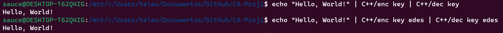
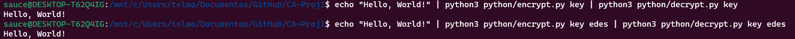
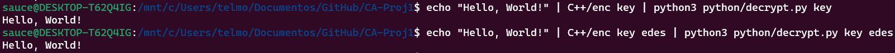
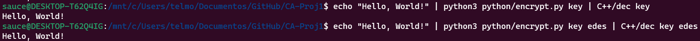
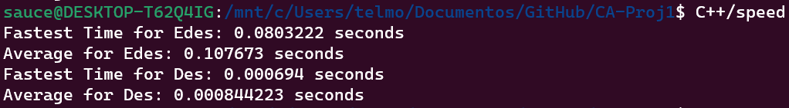
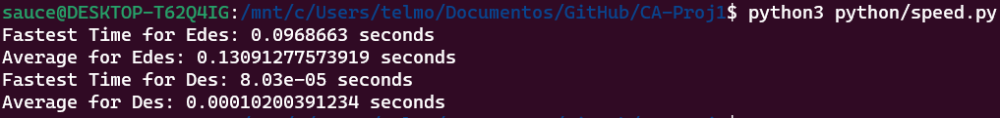
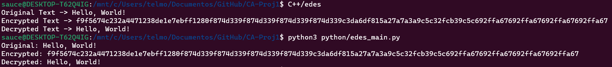
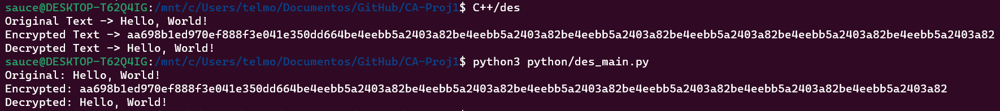

# Building C++

```
./build.sh
```

# Running Encryption and Decryption Applications

### Only C++

```
echo "Hello, World!" | C++/enc key | C++/dec key
```
```
echo "Hello, World!" | C++/enc key edes | C++/dec key edes
```



### Only Python

```
echo "Hello, World!" | python3 python/encrypt.py key | python3 python/decrypt.py key
```
```
echo "Hello, World!" | python3 python/encrypt.py key edes | python3 python/decrypt.py key edes
```


### C++ to Python

```
echo "Hello, World!" | C++/enc key | python3 python/decrypt.py key
```
```
echo "Hello, World!" | C++/enc key edes | python3 python/decrypt.py key edes
```


### Python to C++

```
echo "Hello, World!" | python3 python/encrypt.py key | C++/dec key
```
```
echo "Hello, World!" | python3 python/encrypt.py key edes | C++/dec key edes
```



# Running Speed

```
C++/speed
```




```
python3 python/speed.py
```



# Edes

```
C++/edes
```
```
python3 python/edes_main.py
```




# Des

```
C++/des
```
```
python3 python/des_main.py
```




